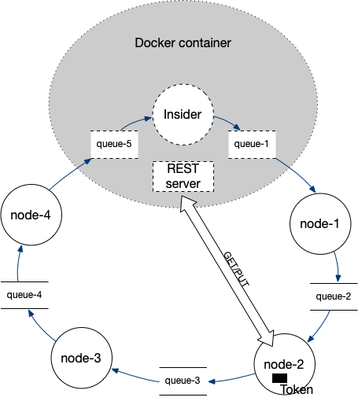

# 4th Assignment

* Each assignment must be the sole work of the student who received it.
* Assignment will be closely monitored, and students may be asked to explain any suspicious similarities with any piece of code available.
* When you submit an assignment that is not your own original work you will get Zero _(we have some tools to identify plagio)_.

This assignment contains an _embedded evaluation application_ which will allow you to see your progress in real-time. You will need **Docker**
and a (recent) version of **IntelliJ** (some help [here](https://gitlab.estig.ipb.pt/dsys/ds-classes/-/wikis/first-steps)).

To start the assessment perform the following steps:

* Open the `docker-compose.yml` file on the root of this project and start the service(s)
  there:
    * Either by hitting the &triangleright;&triangleright; button to start all services;
    * Or, if you prefer to use the terminal, `cd` to the project's directory and issue - `docker-compose up`
* Use your browser to open this url - http://localhost:8989 - if all went well, you should see the assessment information
  and the completion status of each step;
* The docker output log may provide useful information on your progress, inspect it if you're having problems.

The assignment requires you to implement a system for distributed mutual exclusion based on the token ring algorithm (Figure 1). 

 

Figure 1 - Generic architecture

The communication channel is unique between each two nodes and must be implemented with a message queue.
The critical region is simulated with a REST service, implemented inside the docker container, that exposes an internal resource (a `double` number).
The access to the critical region should be performed by a single node at a time and only when in the posession of the `token`. 

In addition, each node will have to call a local method (`shouldUpdate()` from the `UpdateService` SpringBoot service) and
should <b style="color: red">only read/update</b> the critical region if the method returns **true**.
Otherwise, the critical region should not be updated.

The critical region access is simulated with an HTTP `GET` request to get the value (`read`),
a local operation (based on the description below) to change the value,
and a `PUT` request to changed value back in the REST service.

The project contains the following files/packages:

* `src/main/java/pt/ipb/dsys/assessment/four/*` - contains set of packages which you will use to implement four `SpringBoot` applications with an `ActiveMQ producer` and `ActiveMQ consumer`. 
* Each of the mains is located in a sub-package: `app1`, `app2`, `app3` and `app4`. 
* You will have to execute **all** of these mains (`App1Main`, `App2Main`, `App3Main` and `App4Main`).
* The token is a JSON string with the format `{"token":"<the token>"}`
* <b style="color: red">Don't change the names of the `App{N}Main` classes!</b>

The `ActiveMQ Broker`, along side the `queue-1` and `queue-5` queues will already running on the `docker` container you started earlier listening on
`tcp://127.0.0.1:61616`, **<u style="color: red">you don't need to start a docker yourself!</u>**.

<b>Hint</b>: It's always a good idea to stop all other docker containser to avoid port clash!

The next section describes the implementation details you need to achieve in order to complete the assignment.

# Ring Divide

On the `src` of the project you will find the package `pt.ipb.dsys.assessment.four.*` containing 4 `app[1-4]` packages and two additional packages.

Inside, each of the `App{N}Main.main(...)` methods, bootstraps one `SpringBoot` application for the `{N}` node. Implement the additional code _(components)_ to:

* receive the token, 
* to decide if the critical section should be updated, call the method `shouldUpdate()` from the service `UpdateService` (you can use spring's _autowiring_ mechanism to access the service),
* if the critical section is to be accessed, use the HTTP `GET` method to retrieve the value from [http://127.0.0.1:8989/api/resource](http://127.0.0.1:8989/api/resource),
* <b style="color: green">Divide</b> the value by `1.1` to obtain the new resource value,
* Use the `PUT` method to place the value in the URL [http://127.0.0.1:8989/api/resource/{value}](http://127.0.0.1:8989/api/resource/{value}),
  <i style="color: #777; font-size: 0.9em">Where `{value}` is the new resource value, the payload of the `PUT` request will be ignored and can be `null`.</i>
* forward the token to the next node.

In order to start the ring, click the `Start Ring ▶` on the right side of the page at http://127.0.0.1:8989/.
The `Insider` process will try to run the ring 100 times and compare the expected value at the end.

To keep up with the status a **Current Status** area is provided.

**Good Luck!**